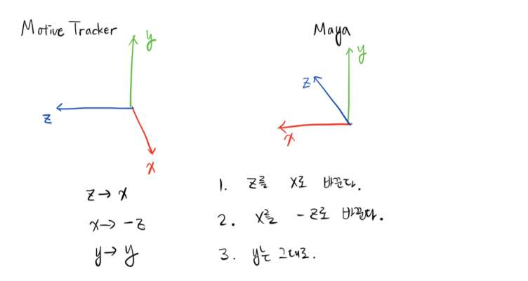

# Marker_based_Facial_Mocap

## 간략한 소개
  
Optitrack으로 얻은 얼굴 움직임 데이터 (csv파일)을 이용하여 Maya 2018에서의 아바타에 적용.  
실시간으로도 구동 가능.  

## 페이스 트래킹 마커

## 파일 설명
### include 폴더
<ol>
    <li>FaceRig.ma
        <ul>
            <li>입력되는 데이터를 실제 표정으로 보여줄 아바타</li>
            <li>Maya 2018ver 기준으로 Face Rig 됨.</li>
            <li>최 상단의 사진이 이 아바타의 모습.</li>
        </ul>
    </li>
    <li>csv_file.csv
        <ul>
            <li>실제 아바타 적용을 위한 가공된 csv파일</li>
            <li>21개 마커 각각의 라벨 제거</li>
            <li>프레임 넘버 제거</li>
        </ul>
    </li>
    <li>Calibration Ground Plane_01.csv
        <ul>
            <li>Optitrak에서 얻은 raw한 csv파일</li>
            <li>21개의 마커를 이용</li>
            <li>하나의 마커는 각각 x,y,z 좌표값을 포함한다.</li>
        </ul>
    </li>
    <li>marker_tag.txt
        <ul>
            <li>21개 마커의 순서를 적어놓은 파일</li>
        </ul>
    </li>
</ol>

### src 폴더
<ol>
    <li> expTracker_python_Client.py
        <ul>
            <li>실시간 마커 트래킹 시 사용</li>
            <li>Socket 통신을 위한 Client side 프로세스</li>
            <li>샘플 데이터</li>
        </ul>
    </li>
        <li> expTracker_python_Clinet_Read_Csv.py
        <ul>
            <li>csv파일을 이용하여 마커 트래킹 시 사용</li>
            <li>Socket 통신을 위한 Client side 프로세스</li>
            <li>csv_file.csv파일을 로드하여 사용</li>
        </ul>
    </li>
    <li> expTracker_python_server.py
        <ul>
            <li>실시간 및 csv파일 이용한 마커 트래킹 시 사용</li>
            <li>Socket 통신을 위한 Server side 프로세스</li>
            <li>포트넘버 7777사용, 이 포트를 다른 프로세스가 사용 시 포트 넘버 바꿀 것</li>
        </ul>
    </li>
    <li> Perseus_Marker.py
        <ul>
            <li>실시간 및 csv파일 이용한 마커 트래킹 시 사용</li>
            <li>Maya 프로그램 내에서 포트를 열어 데이터를 수신</li>
            <li>수신 된 데이터를 이용하여 아바타의 마커를 움직임</li>
            <li>포트넘버 7777사용, 이 포트를 다른 프로세스가 사용 시 포트 넘버 바꿀 것</li>
        </ul>
    </li>
    <li> setting.py
        <ul>
            <li>Optitrak의 영점이 맞는지 확인하기 위한 코드</li>
            <li>Maya 프로그램 내에서 포트를 열어 데이터를 수신</li>
            <li>수신 된 데이터를 이용하여 아바타의 마커를 움직임</li>
            <li>포트넘버 7777사용, 이 포트를 다른 프로세스가 사용 시 포트 넘버 바꿀 것</li>
        </ul>
    </li>
</ol>

### 프로그램 구동 순서
<ol>
    <li>Maya 2018을 실행하여 open scene에서 include 폴더의 FaceRig.ma를 실행</li>
    <li>Maya의 script Editor에서 src폴더의 Perseus_Parker.py를 실행</li>
    <li>Start Real Time Expression 버튼 클릭 (포트 열고 데이터 받을 준비)</li>
    <li>src폴더의 expTracker_python_server.py를 실행 (idle이 pycharm보다 빠름)</li>
    <li>src폴더의 expTracker_python_Client_Read_Csv.py(csv파일로 트레킹) 또는 expTracker_python_Client.py(실시간) 실행</li>
    <li>아바타의 표정을 감상</li>
</ol>

### 주의사항

<Ol>
    <li> Optitrak과 Maya의 좌표계가 다르다  </li>    
</Ol>

